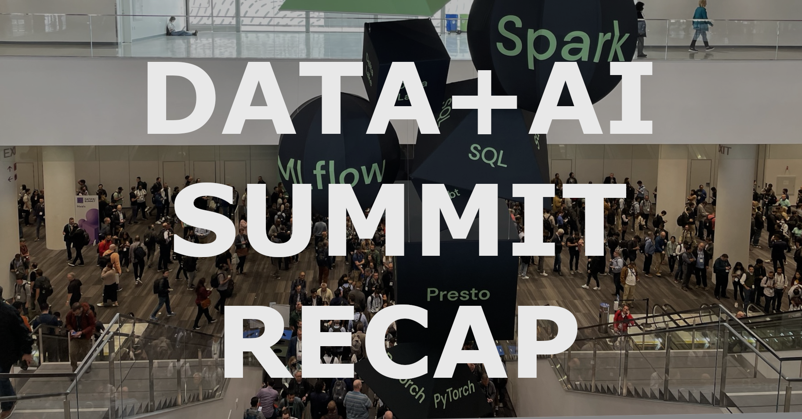

## Real time data processing

Not much has changed on this front

## Governance

## Unification & Open Standards

### Dataframes

- All of the talk about in-memory, columnar datastores is not for naught!

### Delta Lake 3.0

- Unifying streaming parquet formats

### Open Lineage

### Other Databricks Stuff & Things

#### Marketplace

#### Apps
