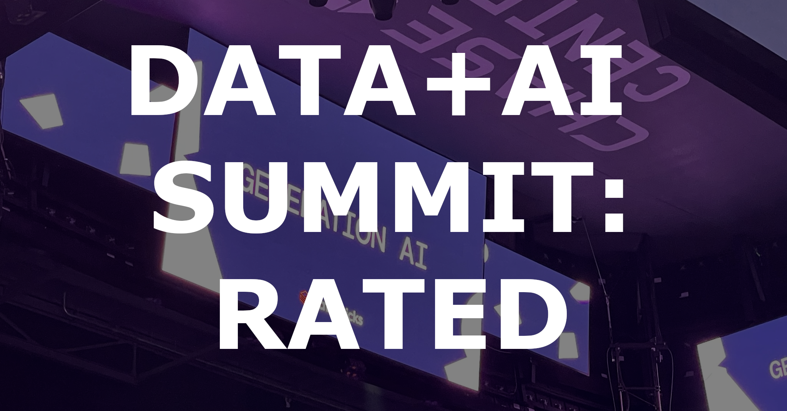
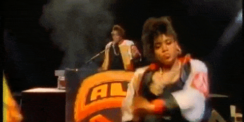
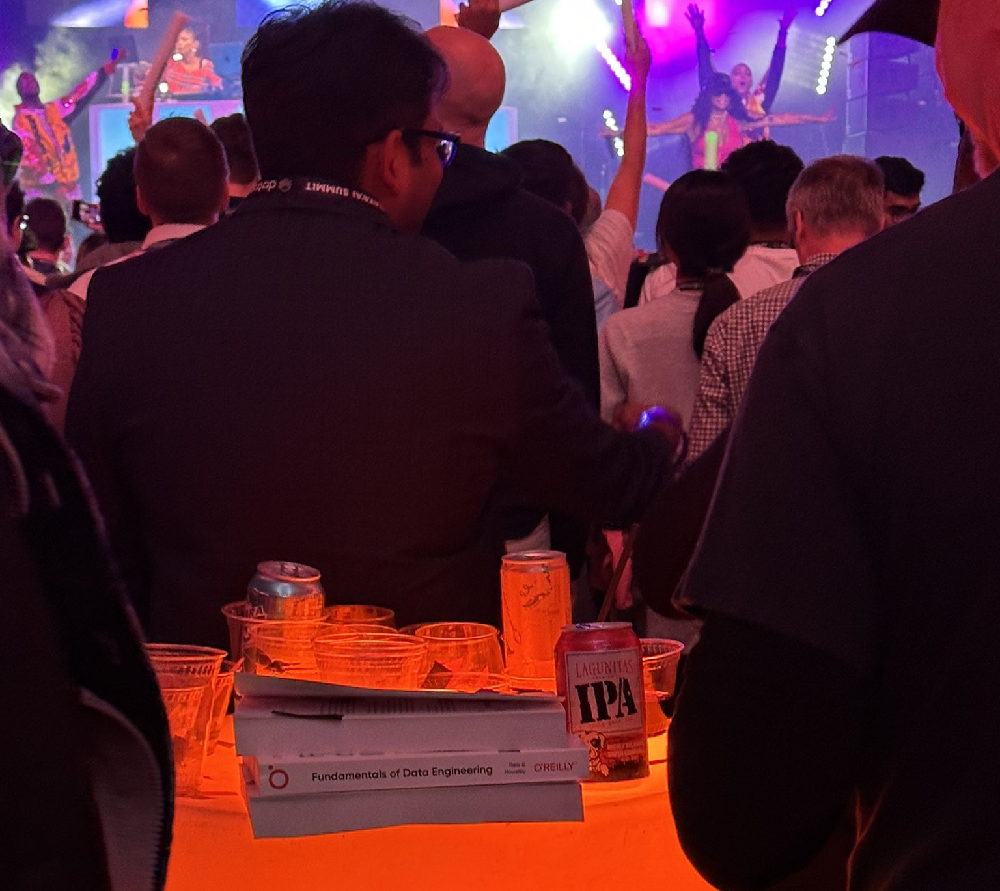
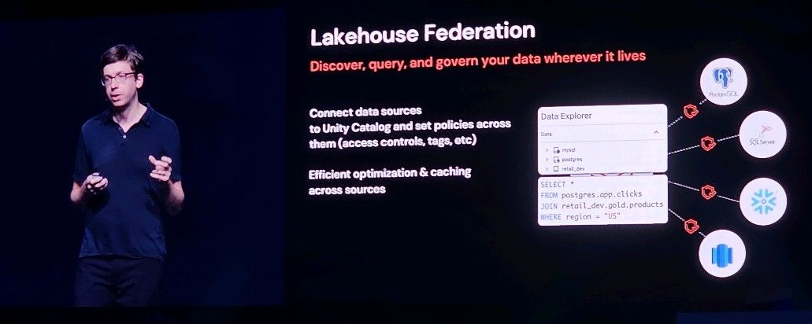
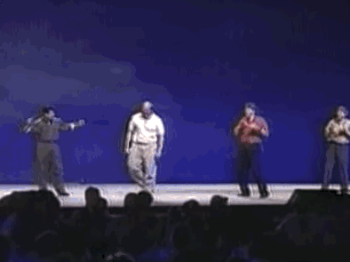

## ToC

## 🧱 Overview

While I synthesize some pedestrian takeaways from the conference (new tech, tools, methods 🥱), I thought I'd present you with what _actually_ matters: my trite opinions on the Moscone Center amenities.

My take is that a good conference experience distances itself from that of an airport as much as possible. At airports, everyone is after your money, it's difficult to find food, agents constantly look for credentials, there's quite a bit of aimless wandering, and the walls are lined with those whose batteries are running low.

I'll leave it to attendees to score Databricks and the Moscone Center in that regard. Now, for the individual components of the _2023 Data+AI Summit_ conference experience:

## ☕️ Coffee

**Score:** 🤨 / 10

Coffee should be a simple affair: is it hot? Does it contain caffeine? Right? Wrong.

The coffee availability at this conference was highly variable. As a result, I ran up my tab at Blue Bottle on $7 single origin pour overs. To kick it off, I did not see a drop of coffee on the first day. Admittedly, I arrived after breakfast, but I found it quite odd for such a large event.

My caffeine levels neared dangerous lows as the start of the conference was accompanied by many yawns. Thankfully, this was rectified on the second day— coffee was present all day! Wow! Quite the turnaround. I was pleasantly surprised and my fears were quelled. I expected the third day to be promising, given full levels of caffeination.

Unfortunately, I was again disappointed: I saw no coffee between the hours of 9:30 and 11:00 AM. Off to Blue Bottle! Oddly, coffee reappeared at 11:30 directly _after_ I parted with $7.63 to Blue Bottle and the State of California. 🤔

When coffee was to be found, it was Peet's. This was satisfactory by my standards. When coffee wasn't present, there was a single small kiosk doling out $5 apples, bananas, and brews. I have never paid $5 for a Granny Smith and this was not going to be the first time I did so.

Snacks, too, seemed to become more abundant as the conference progressed.

## 🌁 SF

(that's short for _San Francisco_ for out-of-towners)

**Score:** 🧖🏻‍♂️ / 10

Full fog and windiness on days one & two followed by glorious sunshine (!!!!) on day three. I was freezing all days. As Mark Twain said: "The coldest winter I ever spent was in the Moscone Center." At least, I'm pretty sure that was the quote.

Also, shout-out to the folks at [Striim](https://www.striim.com/), who held an _outdoor_ event on the Bay, but made sure sufficient heaters were present. It was very comfortable with some pretty sweet views. I enjoyed the ceviche and got a signed copy of _Fundamentals of Data Engineering_.

I left a happy camper. 🎒😎

## 🎙️ Talks

**Score:** 🤓 / 10

Another rollercoaster of an experience. On the first day, there was no line management. At all. One could argue the core experience of a conference are the talks, so I found this... interesting.

All talks were held in one of 12 conference halls. Lines snaked around the main hall back to the doors of the keynote. I, in my decaffeinated state, managed to:

- Get into a super long line and end up in the wrong talk.
- Get into a line where the talk reached capacity and I wasn't allowed in 😢.

To the credit of the organizers, this was completely fixed on the second day, but I feel like this is something to have on day one.

Another observation: presentations not only had no standing room, but standing was entirely disallowed (fire code was blamed?). There's plenty of sitting at conferences, so it's nice to stand and watch a talk sometimes. Oh well 🤷‍♂️.

That being said, I found most of the speakers fantastic and the content great. I _love_ the data community and I'm so grateful to learn from such bright minds.

I think my favorite talk was by Oz Katz of [lakeFS](https://lakefs.io/): _Delta-rs, Apache Arrow, Polars, WASM: Is Rust the Future of Analytics?_

It was both funny and informative. While I'm skeptical of Rust as a replacement for Python, Rust-backed Python packages are already changing the game 🐻‍❄️. I also think the solutions Oz presented in WebAssembly (WASM) warrant a further look. This tech is _so_ under the radar (my coworker and I had no idea what WASM stood for), but seems super useful.

## 🎉 Events & Socialization

**Score:** 🥳 / 10

My favorite part of conferences (after snacks), I get the most value from meeting other passionate folks and learning about their experiences. I accomplished just that: there was no shortage of sharp individuals to chat and mingle with.

On Wednesday night, I spoke with a guest from Australia who observed that Americans seem to spend their money with almost no self-control. Having recently moved to the Bay Area, I was in no position to argue. Additionally, his observation occurred at the Chase Club, which is located court-side at the home of the Golden State Warriors. This took place at an event where Databricks rented the entire stadium for a performance by none other than Salt-N-Pepa... he might be on to something.

Personally, I'm a much bigger fan of low-key events. I didn't even know who the performers were until some more... ahem... “distinguished” members of the community informed me.

Give me some solid snacks and a room full of nerds and I'm more than happy to chat for hours. Renting the entire Chase Center was clearly a big flex by Databricks, Salt-N-Pepa more of a weird flex. My favorite moments were their pauses for the audience to sing along— after the very first it was apparent that we were not prepared to go word-for-word with the 1995 Grammy-award winning duo.

The concert also highlighted that, while most technical authors fear their material being used as a sedative, Matt & Joe should be proud theirs is as interesting as a live hip-hop performance.

<figcaption>Thanks to <a href=https://twitter.com/paolapardoat/status/1674296693846867969>Paola</a> for sharing.</figcaption>

## 🥩 Beef with Snowflake

**Score:** 😡 Unlikely to recommend

Snowflake billboards outnumbered Databricks 3-to-1 on the 101, oof. While Databricks had Snowflake logos in their slides and made unification a _major_ theme, this appeared to be a shallow attempt at taking the high road evidenced by literally holding a conference on the same day as their competitor.

<figcaption>Thanks to <a href=https://www.linkedin.com/posts/mehd-io_i-wonder-if-snowflake-had-somewhere-in-their-activity-7079875867849420800-yEqZ>Medhi</a> for sharing.</figcaption>

In all seriousness, I do not appreciate these companies bifurcating the data community.

While few practitioners would have attended both conferences (not for $2k each, at least) many vendors and data community members would have. I am pretty disappointed: competition should drive progress and unite the community, not the opposite. A long-term view recognizes there is no fixed pie for market share— competition and collaboration make the pie bigger.

The easier it is to access and analyze data, the more folks join the data movement. A great example is Tesla's supercharger network. Rivian signing on means their customers now have a broad network to charge their vehicles. Tesla makes a bunch of money from licensing, Rivian's customers are happy, and more EVs will sign on. EVs win, Tesla wins, manufacturers win... Most importantly the customer wins.

Gee, wow. It's almost like we can create win-win-win scenarios by ignoring ego. 🤨

It doesn't matter if you're a Snowflake or Databricks customer, at the end of the day, you're a member of the data community. We should be sharing solutions and improving the data experience as a community, not seeing who can throw the biggest party, invite the most famous guest speakers, or make the biggest headlines /rant.

## 💯 Overall

I could have done without the very loud pop music being piped into every crevice of the Moscone Center, but aside from a few quirks, I had a blast. I met amazing people, learned a ton, and gained a better understanding of where data is headed.

I said it earlier and I'll say it again: I'm so grateful for the data community. I heard the phrase "a rising tide lifts all ships" no less than three times this week. The vast majority of practitioners _and_ companies are out there to move the needle for _everyone_ in data. Let's do it, together!

## 🏆 "Best of" awards

**Best snack:** Matcha macarons. 🤤

**Worst snack:** "Party mix." 🤨 On a positive note, the trail mix was surprisingly good.

**Best feature:** The Rivian parked in the Expo Hall. By far the most interesting part of the week.

**Busiest booth:** Somehow, Microsoft. There were no less than 50 people there at all times. At one point, a very boisterous man in a suit with a bulging forehead vein was attempting to hype the crowd, with moderate success. I have no idea what was going on, but I guess they still got it.

**Best dressed:** Guy/gal in duck costume at DuckCon.

**Favorite swag:** Databricks tee informing everyone about my modeling career.

**Best drink:** Bubbly Lime— hits like the base at a Salt-N-Pepa concert.

